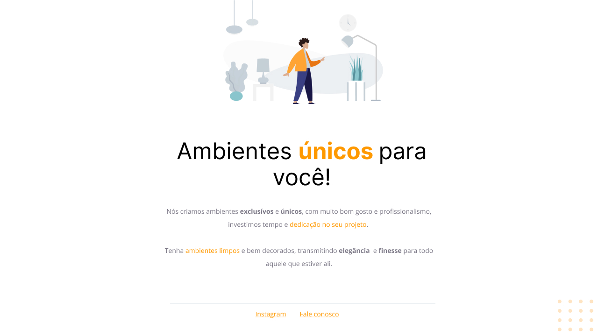

<h1 align="center"> Desafio: Corrigindo Bugs </h1>

Projeto realizado como desafio de correção de bugs para o curso Explorer da Rocketseat.  

  <a href="#-tecnologias">Tecnologias</a>&nbsp;&nbsp;&nbsp;|&nbsp;&nbsp;&nbsp;
  <a href="#-projeto">Projeto</a>&nbsp;&nbsp;&nbsp;

 

  

## 🚀 Tecnologias

Esse projeto foi desenvolvido com as seguintes tecnologias:

- HTML
- CSS
- Git e Github
- Figma

## 💻 Projeto

O desafio foi proposto no curso Explorer da Rocketseat. A ideia é corrigir o código HTML e CSS da página que inicialmente estava bagunçada.

- [Visite o projeto online](https://guiogigo.github.io/Rocketseat-Desafio01/)

-----

Feito por: <strong>Guilherme Batista</strong>
