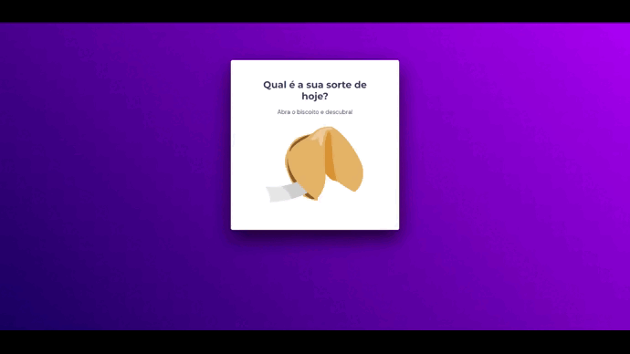

<h1 align="center"> <strong>Desafio: Biscoito da Sorte</strong> </h1>

Projeto realizado como desafio para criação de um jogo chamado Biscoito da Sorte, no qual o usuário, a partir de um clique ou enter, abre um biscoito com a sua sorte do dia. 

  <a href="#-tecnologias">Tecnologias</a>&nbsp;&nbsp;&nbsp;|&nbsp;&nbsp;&nbsp;
  <a href="#-projeto">Projeto</a>&nbsp;&nbsp;&nbsp;

 

  

## 🚀 Tecnologias

Esse projeto foi desenvolvido com as seguintes tecnologias:

- HTML
- CSS
- Git e Github
- Figma
- JavaScript

## 💻 Projeto

O desafio foi proposto no curso Explorer da Rocketseat. A ideia é aplicará o que aprendeu sobre vários temas, entre eles:

- Estrutura de dados HTML
- Animações com CSS
- Funções no Javascript
- Manipulação da DOM
- Biblioteca JS Math()
- Funções *callback*
- Arrays.

<strong> [Visite o projeto online](https://guiogigo.github.io/Rocketseat-Desafio-BiscoitoDaSorte/) </strong>

-----

Feito por: <strong>Guilherme Batista</strong>
